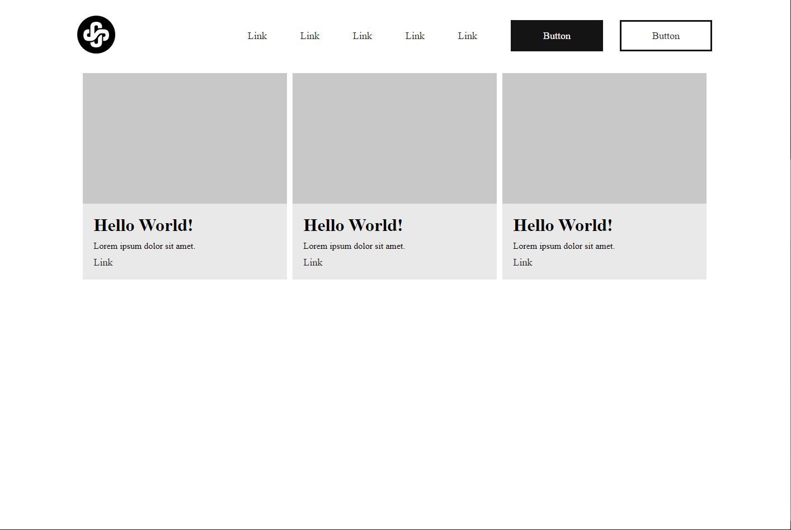

Mini library made in CSS.

All features:
.flex (.flex-direction-[direction], .align-items-[value], .justify-content-[value])
cards (.cards - parent (for multiple cards), .card > .card-header and .card-body)
buttons (.buttons - parent (for multiple buttons), .button, .outlined)
.header

